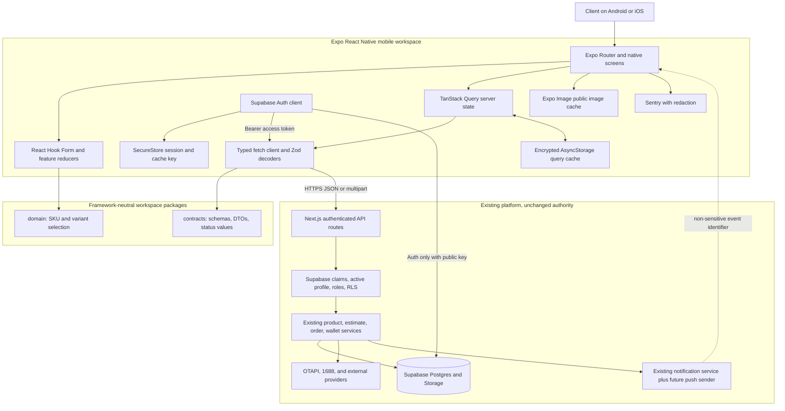

# Client Mobile Application Architecture

Status: Phase 2 architecture decision  
Decision date: 2026-09-01  
Applies to: future Android and iOS client application  
Implementation status: not started

This document defines the technical architecture for the client mobile application. It does not authorize business-feature implementation, dependency installation, project initialization, database or API changes, or repository restructuring. The existing Next.js/Supabase platform remains the only business backend.

Authoritative product and repository context:

- `docs/AGENTS.md`
- `docs/mobile/MOBILE_PRODUCT_SPEC.md`
- `docs/mobile/MOBILE_REPOSITORY_AUDIT.md`
- `docs/PROJECT_ARCHITECTURE.md`
- `docs/API_CONTRACT.md`
- `docs/DATABASE_DESIGN.md`
- `docs/IMPLEMENTATION_CHECKPOINTS.md`

The requested root-level `AGENTS.md` does not exist; its repository location is `docs/AGENTS.md`.

## 1. Architecture decision record

### ADR-MOB-001: Expo React Native client over the existing authenticated API

**Status:** Accepted for future implementation, subject to the owner-supplied identifiers and accounts listed below.

**Context:** The platform is an existing React/Next.js/TypeScript application with Supabase Auth, Postgres, RLS, protected API routes, provider integrations, and a mature wallet ledger. The mobile product requires native Android and iOS interaction without duplicating these systems. Development currently occurs on Windows and cannot assume a local Mac.

**Decision:**

- Build the client app with React Native through the current stable Expo SDK, Expo Router, and strict TypeScript.
- Use Expo's managed configuration and Continuous Native Generation (CNG). Do not commit generated `android/` or `ios/` projects unless a later native requirement proves that managed CNG cannot support it.
- Use development builds with `expo-dev-client` for normal development and testing. Expo Go may be used only for an initial toolchain smoke test, not as the production development runtime.
- Keep the existing Next.js application at the repository root. Later, add a small npm workspace overlay containing `mobile/`, `packages/contracts/`, and `packages/domain/`; do not move the web application to `apps/web`.
- Use Supabase directly only for authentication. Send the resulting access token to the existing Next.js API as a bearer token for every private business operation.
- Do not create a mobile-specific backend. Required mobile endpoints or contract corrections belong in the existing authenticated API boundary.
- Keep all provider access, service-role access, database mutations, financial calculations, authorization, RLS, status transitions, and audit behavior server-side.

**Consequences:**

- React and TypeScript knowledge transfers from the web team, but web components and browser/Next.js implementations do not.
- Expo reduces native build and upgrade work and provides a cloud iOS route from Windows, but introduces Expo SDK compatibility constraints and optional reliance on EAS services.
- A limited workspace change will eventually affect the root lockfile, so it must be introduced independently and verified against the existing web app before mobile initialization.
- Stable shared contracts must be extracted before substantial feature work; route-local types cannot be treated as a mobile SDK.
- App Store/Play Store accounts, permanent application IDs, a production domain, and service ownership are prerequisites for production builds, not decisions for an implementer to guess.

## 2. Selected mobile framework

Use:

- React Native.
- Current stable Expo SDK, pinned with Expo-compatible package versions at initialization time. At this decision date, current Expo documentation identifies SDK 57.
- Expo Router.
- Strict TypeScript.
- Expo managed configuration with CNG and the template's supported Hermes/React Native defaults.
- EAS Build for signed development, preview, and production binaries.

Do not manually choose an independent React Native version. The Expo SDK controls the compatible React Native, React, Expo Router, and native-module versions. Use `npx expo install` during the future initialization phase so dependencies match the selected SDK.

Official references:

- [React Native recommends a framework such as Expo](https://reactnative.dev/blog/2024/06/25/use-a-framework-to-build-react-native-apps).
- [Expo project creation and current stable SDK](https://docs.expo.dev/get-started/create-a-project/).
- [Expo TypeScript guidance](https://docs.expo.dev/guides/typescript/).

## 3. Why it was selected

Expo React Native is the smallest production-capable choice for this repository because:

- The team can retain React component and TypeScript language knowledge without pretending React DOM components are portable.
- Expo provides coordinated versions of native modules, routing, asset handling, development builds, updates, and cloud builds instead of requiring the project to assemble its own React Native framework.
- Expo Router supplies native stack/tab primitives, typed file-based routes, and consistent deep-link handling with less custom navigation infrastructure.
- EAS Build can compile and sign both Android and iOS remotely, which directly addresses the Windows/no-local-Mac constraint.
- Expo supports npm workspaces and automatically configures Metro for current workspace monorepos, allowing small pure packages without moving the web app.
- Supabase publishes React Native/Expo authentication guidance, and the existing server already forwards bearer authorization into its Supabase server client.
- CNG keeps native projects reproducible from app configuration while retaining an escape hatch for compatible native libraries or config plugins.

The choice is based on maintenance and deployment fit, not merely on the existing use of React.

References:

- [Expo Router architecture](https://docs.expo.dev/router/introduction/).
- [Expo workspace/monorepo support](https://docs.expo.dev/guides/monorepos/).
- [EAS Build](https://docs.expo.dev/build).
- [Supabase Auth with React Native](https://supabase.com/docs/guides/auth/quickstarts/react-native).

## 4. Alternatives rejected and why

### Bare React Native Community CLI

Rejected for the first app. It would require direct Android/iOS project ownership, more native dependency coordination, and a Mac or separate macOS CI strategy for routine iOS work. No existing feature requires native changes unavailable through Expo modules/config plugins. Re-evaluate only if a proven native dependency cannot work with Expo/CNG/EAS.

### Flutter

Rejected. It introduces Dart, a second UI/runtime ecosystem, separate contracts tooling, and no direct reuse of the current TypeScript types or selection helpers. Its native performance benefits do not offset the additional platform ownership for this client app.

### Kotlin Multiplatform or fully separate Swift/Kotlin apps

Rejected. They provide maximum platform control at substantially higher implementation, staffing, parity, and testing cost. The product does not currently require platform-specific experiences that justify two native clients.

### Capacitor, PWA, or a Next.js WebView wrapper

Rejected. These approaches maximize reuse of browser code at the cost of native navigation, input behavior, caching, accessibility, file handling, push integration, and the requested smooth native experience. They would also preserve browser/cookie assumptions the audit identified as non-reusable.

### Direct React Navigation without Expo Router

Rejected for initial architecture. Expo Router already provides native navigation on top of the React Navigation ecosystem, typed routes, auth route groups, and automatic link routing. Do not install or import external `@react-navigation/*` packages in application code alongside the current Expo Router architecture.

### Separate mobile backend or direct Supabase business access

Rejected. A second backend would duplicate authorization and business orchestration. Direct PostgREST/table access would bypass the existing API service layer and encourage business logic in the app even where RLS is present.

## 5. Repository placement

### Selected layout

During the future architecture-foundation phase, evolve the repository to:

```text
/
├── app/                         # existing Next.js web/API app; remains in place
├── components/                  # existing web components
├── lib/                         # existing web/server modules
├── services/                    # existing server services
├── supabase/                    # existing migrations/tests
├── mobile/                      # future Expo application workspace
├── packages/
│   ├── contracts/              # portable API/status/schema package
│   └── domain/                 # portable SKU/variant selection package
├── package.json                # existing web package + minimal workspaces field
└── package-lock.json           # one reviewed workspace lockfile
```

Add npm workspaces for `mobile` and `packages/*`. The repository root continues to be both the workspace root and the existing web application package. Do not rename it, move it to `apps/web`, or change its framework merely for symmetry.

### Why not `apps/web` and `apps/mobile`

Moving the current production-oriented web app would touch paths, aliases, scripts, deployments, tests, documentation, and imports without improving mobile behavior. The small asymmetry is safer than a broad restructure.

### Workspace safeguards

- Introduce the workspace metadata as its own change before generating the mobile project.
- Reinstall from the root and verify one lockfile deliberately; do not maintain unrelated nested lockfiles.
- Run `npm why react`, `npm why react-native`, and Expo dependency checks from the mobile workspace to prevent duplicate React/native-module versions inside the mobile bundle.
- Shared packages must declare React only as a peer dependency if ever needed. The selected packages should remain React-free.
- If workspace resolution changes existing web dependencies or checks, stop and correct the workspace setup; do not upgrade the web app to satisfy mobile package versions.

## 6. Module boundaries

### `mobile/`

Owns:

- Native routes, screens, components, design tokens, accessibility, and platform behavior.
- Supabase native auth client and secure session adapter.
- Typed HTTP transport and query functions.
- TanStack Query configuration and persistence policy.
- Local order-draft reducer and form composition.
- Mobile localization/status labels.
- Deep-link, push, file-picker, image, monitoring, and build configuration.

Must not own:

- Provider normalization or provider credentials.
- Authoritative price, estimate, wallet, shipping, exchange-rate, profit, status, authorization, or ownership logic.
- Direct database writes or service-role behavior.

### `packages/contracts/`

Owns only framework-neutral wire contracts:

- Canonical enum/status values.
- API success/error envelope schemas and error codes.
- Request/response Zod schemas and inferred DTOs.
- Pagination metadata.
- Product/SKU, order-card/detail, estimate, wallet, statement, favorite, notification, and payment-proof wire types after their contracts are approved.
- Money values as explicitly documented wire representations; no arithmetic.

It must not import React, React Native, Next.js, Node APIs, Supabase clients, environment variables, storage, or route code.

### `packages/domain/`

Owns only pure client interaction logic:

- SKU quantity selection state.
- Variant option grouping/matching/availability.
- Selection summaries explicitly marked provisional.

It may depend on `contracts`. It must not contain estimate calculations, tariffs, provider parsing, database types, UI, networking, or storage.

### Existing web/server roots

Continue to own Next.js pages/components, API route handlers, Supabase clients/repositories, provider integration, persistence, business calculations, status transitions, financial accounting, notifications, and audit behavior.

## 7. Shared-code strategy

### Share

- Zod schemas and inferred wire types once routes actually conform to them.
- API envelope and error-code definitions.
- Canonical status values, not UI labels.
- Pure SKU and variant selection helpers currently represented by `lib/product-sku-selection.ts` and `lib/product-variant-selection.ts`.
- Test fixtures that contain no secrets or production personal/financial data.

### Keep separate intentionally

- Web React components and mobile React Native components.
- Web and mobile navigation, auth presentation, secure storage, file picking, image rendering, and accessibility implementations.
- Localized status wording and platform-specific formatting/presentation.
- Web server API response creation versus mobile response decoding.
- Web query/loading patterns versus mobile query and app-lifecycle behavior.

### Keep server-only

- Provider lookup and normalization. Although some functions are pure, sharing them would invite local provider authority and expose an integration model the app does not need.
- Fixed-point estimate engine. The audit found it portable and well tested, but shipping it in the mobile bundle would create a second executable financial engine. Mobile receives the server breakdown and may calculate only clearly provisional SKU product subtotals.
- Shipping tariffs, exchange/profit configuration, wallet math, order lifecycle, repository/RPC code, integration logs, and service-role helpers.

### Extraction rules

- Extract in small moves with unchanged public web behavior and existing tests passing after each move.
- Do not copy then independently maintain canonical enums or schemas.
- Do not expose internal database rows as mobile DTOs; define client-safe wire schemas.
- Shared code uses package imports, not `../../` imports into the web root.

## 8. API communication strategy

### Boundary

The mobile app calls the existing HTTPS Next.js `/api/...` routes. It does not call Supabase Data API, database RPCs, Edge Functions, or provider APIs directly for business behavior.

### Transport

Build a small mobile-specific wrapper over the platform `fetch` implementation:

- Base URL from validated public environment configuration.
- `Authorization: Bearer <access-token>` on every private request.
- `Accept: application/json`; JSON content type for JSON requests.
- Multipart bodies set their own boundary and are not JSON-stringified.
- AbortController-based timeouts and cancellation propagated from TanStack Query.
- Client-generated request ID for diagnostics and idempotency key where the contract supports it.
- Parse the response body once, validate it against the shared success/error Zod schema, and reject malformed envelopes as a contract error.

### Default timeout and retry policy

| Operation | Timeout | Automatic retry |
| --- | ---: | --- |
| Ordinary GET | 15 seconds | Up to 2 retries for network failure, timeout, 429 with valid retry guidance, or 5xx; exponential delay with jitter. |
| Provider product resolution/refresh | 30 seconds | No hidden retry; show progress and let the client retry deliberately. |
| JSON mutation | 20 seconds | None. |
| Payment-proof upload | 120 seconds | None; interrupted uploads remain unsubmitted unless the server returns an identifier. |
| Order confirmation | 30 seconds | No blind retry; reconcile by idempotency key/authoritative read before resubmission. |

A 401 triggers one guarded Supabase session refresh and one request replay. A second 401 clears the session and returns to authentication. Never retry 400/403/404/409/422-style business failures automatically.

### Contract requirements before feature use

- Remove or explicitly de-authoritize caller-provided `clientId` in client mutation schemas.
- Resolve multi-SKU estimate versus direct confirmation behavior.
- Type and document order cards, order detail, statement rows, wallet, favorites, and notifications.
- Add order cancellation/refund and complete repeat-order contracts before exposing those actions.
- Preserve the existing response envelope and backwards compatibility for web/extension consumers.

## 9. Authentication strategy

### Sign-in and session

- Use `@supabase/supabase-js` with the public/publishable project key.
- Configure `persistSession: true`, `autoRefreshToken: true`, and `detectSessionInUrl: false`.
- Register exactly one native `AppState` listener: start auto-refresh only while active and stop it while backgrounded.
- Listen to auth-state changes once at the provider root.
- Keep the splash/auth gate visible until secure storage is hydrated and the session has been checked.
- After local session recovery, call a protected backend identity/profile endpoint or the first protected bootstrap endpoint. The backend remains authoritative for active status and `client` role.
- A valid Supabase session with a missing/inactive/non-client profile enters a forbidden/support state and is not treated as an authenticated client workspace.

### API use

The native Supabase client supplies the current access token only. Business query functions pass that token to the Next.js API, where existing claim validation, profile lookup, role checks, and RLS execute.

### Recovery and confirmation

- Use a stable custom scheme for development auth callbacks and production Universal/App Links when the domain is approved.
- Register the exact callback patterns in Supabase Auth configuration.
- Parse recovery/confirmation tokens only in the dedicated auth callback route.
- Do not accept notification/entity links as auth callbacks.
- Password auth is the initial parity target. Social/biometric sign-in is not added without a separate approved product/security decision.

### Sign-out and account change

Revoke/sign out through Supabase where possible, then delete secure session chunks, encrypted-cache key, encrypted persisted queries, drafts, user-scoped memory queries, notification tokens for that installation, and private temporary files. Public image cache may remain only if it cannot reveal private signed content.

## 10. Secure session/token storage strategy

Use `expo-secure-store` through a custom Supabase storage adapter.

### Chunked value format

- Store at most 1,800 UTF-8 bytes per chunk to remain below historically restrictive platform limits.
- For logical key `K`, store chunks under versioned keys such as `K.v1.0`, `K.v1.1`, and a small manifest `K.v1.meta` containing version, chunk count, and checksum/digest.
- Write new chunks first, then replace the manifest; remove surplus old chunks only after the manifest commits.
- On read, validate the manifest, chunk count, and digest before reconstructing JSON. A missing/corrupt chunk invalidates the session and clears the logical value.
- On remove, delete the manifest and every listed chunk, tolerating already-missing keys.
- Handle native SecureStore read/write failures explicitly; never fall back to plaintext token storage.

Do not enable `requireAuthentication` for refresh-token storage because background/foreground session refresh must not prompt for biometrics. Biometric app unlock may later gate UI access, but it must be an additional local screen lock rather than the token storage mechanism.

SecureStore is appropriate for small encrypted secrets but can reject large values on underlying platforms, which is why the adapter is chunked. [Expo SecureStore](https://docs.expo.dev/versions/v54.0.0/sdk/securestore/)

## 11. Server-state caching

Use TanStack Query as the sole owner of API/server state.

### Query-key policy

Every private key begins with the authenticated client/profile identifier, for example:

```text
[clientId, "orders", filters]
[clientId, "wallet", filters]
[clientId, "statement", filters]
[clientId, "notifications", page]
```

Never reuse cached private data while the client identity is unknown or changes.

### Freshness defaults

| Data | In-memory stale time | Foreground behavior | Persistent eligibility |
| --- | ---: | --- | --- |
| Wallet totals/ledger | 0 | Always refetch | Yes, encrypted, read-only stale display. |
| Payment proofs/instructions | 0 | Always refetch | Instructions may persist; proof history may persist encrypted; proof files never persist. |
| Active order cards/detail | 30 seconds | Refetch active/attention data | Yes, encrypted. |
| Completed order detail | 5 minutes | Refetch on explicit refresh | Yes, encrypted. |
| Product Statement | 5 minutes | Refetch current filter/page | Yes, encrypted, bounded pages. |
| Notifications | 15 seconds | Refetch inbox/unread count | Yes, encrypted. |
| Resolved product/SKU display | 5 minutes | Fresh resolution required before financial action | Yes, encrypted; never authorizes stock/price. |
| Help/policy content | 24 hours | Refresh opportunistically | Yes. |

Mutation success invalidates affected query families. Do not manually recompute canonical wallet balances, statement totals, or status transitions in cache. Optimistic updates are limited to reversible presentation such as a read indicator; financial and order mutations wait for the server result.

TanStack Query persistence uses the supported async persister interfaces. [TanStack async persister](https://tanstack.com/query/latest/docs/framework/react/plugins/createAsyncStoragePersister)

## 12. Persistent local cache

Use `@react-native-async-storage/async-storage` only behind an application encryption adapter for private/query data.

### Encryption

- Generate a random 256-bit AES key with Expo Crypto on first authenticated use.
- Store only that key in SecureStore.
- Encrypt each serialized cache record with AES-GCM using a fresh random IV; store version, IV, ciphertext, and authentication tag in AsyncStorage.
- Bind associated data to app ID, environment, client ID, cache schema version, and record key so ciphertext cannot be moved between users/environments unnoticed.
- Authentication/decryption failure deletes the affected cache and proceeds with an online reload; it never falls back to plaintext.

Expo Crypto supplies native AES-GCM operations, avoiding an additional third-party cryptography implementation. [Expo Crypto](https://docs.expo.dev/versions/v57.0.0/sdk/crypto/)

### Persistence policy

- TanStack dehydration uses an explicit allowlist; mutations are excluded.
- Maximum retained age is 24 hours even when a query's in-memory stale time is shorter.
- Persist at most the most recent three pages for each paginated capability and evict least-recently-used allowed entries when the serialized cache exceeds 10 MB.
- Cache keys include environment, authenticated client ID, API contract version, cache schema version, and app runtime version.
- Clear private cache on sign-out, client change, encryption-key loss, schema incompatibility, explicit user action, or security event.
- Never store payment proof contents, private signed URLs, provider raw payloads, integration/audit records, service credentials, or mutation queues.

Do not introduce SQLite, Realm, WatermelonDB, or an ORM for v1. The app does not need local relational authority or sync conflict resolution.

## 13. Image caching

Use `expo-image` rather than React Native's basic image component for remote product imagery.

- Public supplier/product images use `memory-disk`, stable dimensions, content-fit rules, and a neutral placeholder/fallback.
- List thumbnails request/use appropriately sized sources when the backend/provider supplies them; never decode unnecessarily large images into small cells.
- Detail images may be prefetched only for the currently opened product, not an entire result set.
- Variant images reuse a deterministic cache key based on the public URL or backend-supplied immutable image identity.
- Private images and signed URLs default to memory-only/no persistent cache and must not use a cache key that survives URL expiry.
- Payment proofs are not displayed or cached in the client app after upload unless a later protected client-preview contract is approved.
- Image failure never blocks textual product/SKU identification.

`expo-image` provides memory/disk policies and prefetch/cache controls that the basic component does not. [Expo Image](https://docs.expo.dev/versions/latest/sdk/image/)

## 14. State management

Use the narrowest owner for each state category:

| State | Owner |
| --- | --- |
| API/server data | TanStack Query. |
| Authentication/session lifecycle | One React context/provider around the router. |
| Connectivity/app foreground state | One platform context/adaptor feeding Query online/focus managers. |
| Active new-order draft | A feature-scoped React reducer persisted through the encrypted cache when safe. |
| Form input and validation | React Hook Form plus Zod resolver. |
| Navigation state | Expo Router/native navigator. |
| Component interaction state | Local `useState`/`useReducer`. |

Do not add Redux or Zustand in the foundation. Add a global state library later only if multiple unrelated features require high-frequency shared client state that cannot be expressed through these owners. Server responses must never be copied into a global client store.

## 15. Navigation

Use Expo Router with typed routes and route groups:

```text
mobile/app/
├── _layout.tsx                 # providers, error boundary, auth bootstrap
├── (auth)/
│   ├── login.tsx
│   ├── forgot-password.tsx
│   ├── callback.tsx
│   └── update-password.tsx
├── (client)/
│   ├── _layout.tsx             # authenticated client guard
│   ├── (tabs)/
│   │   ├── index.tsx           # Home
│   │   ├── new-order.tsx
│   │   ├── orders.tsx
│   │   ├── wallet.tsx
│   │   └── account.tsx
│   ├── orders/[id].tsx
│   ├── statement.tsx
│   ├── favorites.tsx
│   ├── notifications.tsx
│   ├── settings.tsx
│   └── help.tsx
└── +not-found.tsx
```

Feature routes may be placeholders only after project initialization; business screens are not part of the architecture foundation.

### Linking

- Development custom scheme: `bridgecart://`.
- Production: HTTPS Android App Links and iOS Universal Links on the owner-approved production web domain.
- The existing web deployment must host `/.well-known/assetlinks.json` and `/.well-known/apple-app-site-association` when identifiers are approved.
- Allowlisted entity routes include notifications and owned order/favorite destinations; unknown links go to a safe not-found screen.
- An entity ID from a link is never proof of ownership. Load it through an authenticated protected API.
- Preserve a requested link through sign-in only as a validated internal route, never as an arbitrary URL.

Expo Router automatically maps native links to routes, but development builds are required to test stable custom schemes and production associations. [Expo linking overview](https://docs.expo.dev/linking/overview/)

## 16. Error architecture

### Error classes

Normalize failures into:

- `AuthenticationRequiredError`
- `ForbiddenError`
- `ValidationError`
- `NotFoundError`
- `ConflictError`
- `ExpiredEstimateError`
- `InsufficientWalletWarning` (successful order metadata/warning, not necessarily a failed request)
- `ProviderLookupError`
- `ManualReviewRequiredError`
- `TimeoutError`
- `ConnectivityError`
- `ContractDecodeError`
- `ServerError`
- `UnknownAppError`

Each contains a safe machine code, localized-message key, retryability, optional field errors, request ID, and HTTP status. It must not retain raw tokens, full payloads, proof paths, or provider response bodies.

### Presentation

- Root error boundary catches otherwise unhandled render/runtime failures and offers safe restart/report behavior.
- Route-level boundaries preserve navigation and offer retry.
- Form errors attach to fields; business conflicts and stale data appear as explicit banners/dialogs.
- Background refresh failures keep visibly stale data and avoid disruptive alerts.
- Mutation failures remain visible until acknowledged; success is shown only after a validated server response.

### Monitoring

Sentry receives release/runtime identifiers, route template, platform, app version, safe error code, and opaque authenticated-user ID only after privacy approval. Redact headers, query/body values, URLs containing tokens, form values, financial payloads, and breadcrumbs with personal data. Disable session replay by default.

## 17. Offline architecture

The app is offline-readable, not offline-transactional.

- Boot from a valid local session and encrypted cache, marking cached server data with its last successful refresh time.
- Allow viewing cached product, order, statement, wallet, notification, and help screens when available.
- Allow editing a local unsubmitted order draft.
- Disable product resolve/refresh, estimate, confirmation, cancellation/refund, wallet funding, proof operations, notification read persistence, and every other business mutation while offline.
- Do not implement an outbox, background mutation queue, or automatic replay.
- On reconnection, mark relevant queries stale and refresh foreground-visible data first.
- If a connection drops after a mutation was sent, reconcile through idempotency or an authoritative read before enabling another attempt.
- Device clock is not authoritative for estimate expiry; server responses/errors decide eligibility.

Use community NetInfo to feed TanStack Query's online manager because React Native does not provide the browser online events Query expects. Network state is advisory: actual request results remain authoritative.

## 18. Notifications

### Selected architecture

- `expo-notifications` handles permission, token acquisition, foreground receipt, and notification response events.
- Use Expo Push Service initially to avoid separate direct APNs/FCM sending infrastructure.
- The existing backend remains the notification source and sender. No new notification backend is introduced.
- Existing in-app notifications remain the durable truth. Push is a delivery hint that directs the app to refresh the owned inbox/entity.

### Required future backend contract

Add an authenticated installation registration model and endpoints in a separately approved phase. Store:

- Authenticated profile/client owner.
- Server-generated installation ID.
- Expo push token.
- Platform, app variant/environment, app version, locale, and timezone.
- Enabled/disabled state, last-seen time, token-updated time, and revoked time.

Registration derives ownership from the session. Refresh tokens after reinstall/rotation, disable tokens rejected by the push service, and unregister the installation on sign-out where possible.

### Payload rules

- Include only event type and opaque entity identifier needed to request fresh authorized data.
- Do not include wallet balances, payment details, product notes, proof links, provider payloads, access tokens, or sensitive personal information.
- Opening a push authenticates first, then fetches the referenced entity. Missing/forbidden entities fall back to the inbox.
- Permission denial leaves the in-app inbox fully usable and may be prompted again only through platform-appropriate settings guidance.

Push dependencies are feature-gated until this backend contract and event coverage are approved. [Expo Notifications](https://docs.expo.dev/versions/v57.0.0/sdk/notifications/)

## 19. Environment configuration

Use three explicit environments: `development`, `preview`, and `production`.

### Client-visible variables

| Variable | Purpose | Classification |
| --- | --- | --- |
| `EXPO_PUBLIC_API_BASE_URL` | Existing Next.js API origin | Public, HTTPS required outside local development. |
| `EXPO_PUBLIC_SUPABASE_URL` | Supabase project URL | Public. |
| `EXPO_PUBLIC_SUPABASE_PUBLISHABLE_KEY` | Supabase publishable/anon client key | Public; relies on Auth/RLS. |
| `EXPO_PUBLIC_SENTRY_DSN` | Client event destination | Public, after monitoring approval. |
| `EXPO_PUBLIC_APP_VARIANT` | Development/preview/production runtime label | Public. |
| `EXPO_PUBLIC_FEATURE_*` | Approved release flags only | Public; never authorization. |

Validate configuration with a mobile-only Zod schema before rendering the app. Missing or malformed production configuration fails fast with a safe configuration error.

### Secrets forbidden from the app

Never place `SUPABASE_SERVICE_ROLE_KEY`, OTAPI/RapidAPI credentials, EAS/Apple/Google signing credentials, Sentry auth tokens, database credentials, provider cookies/passwords, or private server keys in `EXPO_PUBLIC_*`, app config extras, source code, or bundled files.

Use EAS environment sets for cloud builds/updates and a gitignored `.env.local` for local development. Anything compiled into client code is public even if EAS labels the build variable sensitive. Build-only secrets such as `SENTRY_AUTH_TOKEN` remain non-public EAS/CI variables and are used only for source-map upload.

Do not overload `NODE_ENV` for app environment selection. [Expo environment variables](https://docs.expo.dev/guides/environment-variables/)

## 20. Testing

### Shared packages

- Node unit tests for Zod success/error envelopes, each DTO, enum/status compatibility, money wire formats, and SKU/variant reducers.
- Compatibility fixtures for every implemented client route.
- Negative tests proving server-only imports and environment access do not enter portable package dependency graphs.

### Existing backend

- Contract tests call/construct each route response and validate it with the shared schema.
- Authorization tests cover missing, expired, wrong-role, inactive, and cross-client sessions.
- RLS and transactional SQL tests remain authoritative for direct database rules.
- Idempotency tests cover lost confirmation responses and retries.

### Mobile unit/component tests

- `jest-expo` plus React Native Testing Library.
- Auth hydration, refresh, revocation, forbidden role, and sign-out clearing.
- SecureStore chunk corruption, encryption/decryption failure, account/environment isolation, and cache migration.
- API envelope decoding, timeout/cancellation, 401 one-refresh policy, retry exclusions, and malformed server responses.
- Query stale/offline/foreground behavior.
- Route guards, deep-link validation, form validation, error states, dynamic text, screen-reader names, and reduced motion.

### End-to-end and device tests

- Maestro smoke journeys on Android local/emulator and EAS-hosted or physical iOS builds.
- Development/preview builds verify SecureStore, deep links, file selection, notifications, and background/foreground behavior; Expo Go results do not count for these capabilities.
- Test on representative low/mid-range Android hardware and at least one current and one older supported iPhone through TestFlight/physical access.
- Simulate slow, intermittent, and offline networks plus app termination during reads/uploads/confirmation.

### Required quality gates after architecture implementation

- Existing web `typecheck`, `lint`, `test`, and production `build`.
- Shared-package typecheck/tests and dependency-boundary checks.
- Expo doctor, mobile TypeScript, lint, Jest, and development/preview EAS builds.
- Contract/RLS tests for every mobile-exposed endpoint.

## 21. Android/iOS build pipeline

### Profiles

Use EAS Build with:

- **development:** development client, internal distribution, development API/Supabase, distinct app ID/name/icon.
- **preview:** release-like internal distribution, preview API/Supabase, production optimizations, no store submission.
- **production:** store signing, production API/Supabase, automatic build-number/version-code increment, monitoring/source maps, and no debugging endpoints.

Do not allow a development/preview binary to point to production through an in-app switch. Environment is selected at build/update time and displayed clearly in non-production builds.

### CI flow

1. Install from the reviewed root lockfile.
2. Run web/shared/mobile static checks and tests.
3. Verify Expo dependencies and configuration.
4. Build preview for both platforms on release candidates.
5. Run smoke tests against preview.
6. Require approval for production EAS Build.
7. Submit signed artifacts through EAS Submit or approved store tooling.
8. Tag the source revision, contract version, app version, native runtime, and EAS update/build identifiers.

EAS can manage signing credentials, but credential ownership must belong to an organization account with recovery and least-privilege access—not an individual developer account. [EAS Build configuration](https://docs.expo.dev/build-reference/build-configuration/)

## 22. Windows development constraints

Supported on Windows:

- Editing TypeScript/React Native code.
- Metro and Expo CLI.
- Android physical-device and Android Emulator development with Android Studio/JDK.
- Unit/component tests and most contract tests.
- EAS cloud development/preview/production builds for Android and iOS.
- Installing iOS internal/TestFlight builds on registered physical devices.

Not available locally on Windows:

- Xcode.
- iOS Simulator.
- Local iOS native compilation, signing diagnostics, Instruments profiling, or direct Xcode debugging.
- Reliable validation of every iOS-specific behavior without a physical device or remote macOS service.

Therefore:

- Use Android for fast local native iteration.
- Produce EAS iOS development builds early, not only before release.
- Maintain access to at least one physical iPhone for authentication, SecureStore, deep links, notification permissions, backgrounding, file upload, accessibility, and TestFlight verification.
- Treat iOS-only build failures as requiring EAS logs and, if unresolved, temporary remote/macOS assistance. The architecture does not assume permanent local Mac ownership.

Expo and React Native support Windows development, while the iOS Simulator/Xcode remain macOS-only. [Expo development/EAS overview](https://docs.expo.dev/tutorial/eas/introduction/), [React Native environment requirements](https://reactnative.dev/docs/set-up-your-environment)

## 23. Deployment approach

### Binary deployment

- Development builds: EAS internal distribution to registered developers/testers.
- Preview builds: internal distribution for acceptance testing against preview backend data.
- Android production: signed Android App Bundle to Google Play internal testing, staged tracks, then production rollout.
- iOS production: remote EAS signed archive, TestFlight internal/external testing, then App Store review/release.

Production iOS does not require a local Mac when EAS Build/Submit manages the cloud build and signing flow, but it does require an Apple Developer membership, App Store Connect app, approved bundle ID/capabilities, compliance metadata, and physical/TestFlight validation. [EAS first build](https://docs.expo.dev/build/setup/)

### Over-the-air updates

EAS Update is optional and must not be enabled until the first stable binary, monitoring, preview validation, and rollback runbook exist.

If enabled:

- Use a fingerprint runtime-version policy.
- Keep development/preview/production channels separate.
- Test an update in preview using the exact production runtime before promotion.
- Roll out production updates gradually and monitor crash/error rates.
- Roll back to the previous or embedded update when necessary.
- Publish no update that requires new native modules, permissions, entitlements, config plugins, or incompatible contracts without a new binary.
- Never use OTA updates to bypass store rules or change server-authoritative business behavior without backend compatibility.

[Expo runtime versions and staged rollout](https://docs.expo.dev/eas-update/runtime-versions/)

## 24. Dependency list

No dependency is installed in Phase 2. Future installation must use Expo-compatible versions and a reviewed lockfile.

### REQUIRED

| Dependency | Purpose | Why platform/existing dependencies are insufficient | Runtime/bundle impact |
| --- | --- | --- | --- |
| `expo`, `react`, `react-native`, `typescript` | Core native runtime and typed development | The existing Next.js/React DOM runtime cannot render native UI or access native lifecycle/build APIs. | Fundamental runtime; versions controlled by Expo SDK. |
| `expo-router` | Typed file-based native navigation and deep links | React Native does not include an application router; hand-built React Navigation duplicates Expo functionality. | Moderate JS/native navigation footprint included by the template. |
| `expo-dev-client` | Project-specific development runtime | Expo Go cannot fully test custom schemes, production native configuration, or all future native modules. | Development-build native module; not an app feature. |
| `@supabase/supabase-js` | Supabase authentication/session refresh | Existing `@supabase/ssr` browser/cookie client is not native-compatible. | Moderate JS networking/auth runtime. Business Data API remains unused. |
| `react-native-url-polyfill` | URL APIs required by Supabase/provider-safe URL handling | Native JavaScript environments do not guarantee the same complete URL APIs as browsers. | Small JS polyfill loaded once. |
| `expo-secure-store` | Encrypted token and encryption-key storage | AsyncStorage is not secure; the web cookie approach is unavailable. | Small native module; limited to small secret values. |
| `expo-crypto` | Random IDs/keys, digests, AES-GCM cache encryption | React Native has no portable Node `crypto`; third-party crypto would add avoidable risk. | Native crypto module; operations occur during persistence, not rendering. |
| `@react-native-async-storage/async-storage` | Encrypted ciphertext/query-cache persistence | SecureStore is unsuitable for bulk cache and React Native has no browser localStorage. | Small native key-value module; cache remains bounded. |
| `@tanstack/react-query` | Server state, pagination, mutation state, refetch/invalidation | React hooks alone would recreate cache/retry/focus behavior across every feature. | Moderate JS runtime; replaces custom server-state infrastructure. |
| `@tanstack/react-query-persist-client` | Query dehydration/rehydration | Core Query keeps memory state only. | Small JS persistence integration. |
| `@tanstack/query-async-storage-persister` | Async encrypted-storage adapter integration | Core Query does not implement React Native persistence. | Small JS adapter. |
| `@react-native-community/netinfo` | Connectivity events for query online state | Browser online/offline events do not exist reliably in React Native. | Small native module/listener. Network result remains authoritative. |
| `zod` | Shared runtime request/response/config/form validation | TypeScript types disappear at runtime; route responses can drift or be malformed. | Moderate JS validation cost at network/form boundaries only. |
| `react-hook-form` | Efficient native form state | Hand-written state/validation across ordering and funding forms increases rerenders and inconsistency. | Small JS runtime, feature-scoped. |
| `@hookform/resolvers` | Zod integration for form errors | Avoids custom adapter/error mapping for every form. | Small JS adapter. |
| `expo-image` | Product/variant image rendering and memory/disk caching | The core image component lacks the selected cache/prefetch controls. | Native image module; reduces repeated downloads but requires cache policy. |
| `@sentry/react-native` | Native/JS crash reporting and release source maps | Console logs and current backend monitoring cannot observe client-native crashes. EAS Observe native crash support is not treated as sufficient while preview-limited. | Meaningful native/JS monitoring footprint; required only before production, with replay disabled. |
| `jest-expo` (dev) | Expo-compatible unit test environment | Current Node tests cannot emulate React Native/Expo modules. | Development only. |
| `@testing-library/react-native` (dev) | Accessible component/interaction tests | React DOM testing tools cannot render native primitives. | Development only. |

### OPTIONAL / FEATURE-GATED

| Dependency | Trigger and purpose | Why not required initially | Runtime/bundle impact |
| --- | --- | --- | --- |
| `expo-notifications` | Add only after device registration/push backend approval | In-app notifications already exist; no current push contract/token storage exists. | Native permissions/background handlers; material configuration. |
| `expo-device` | Provide safe device capability metadata for push setup | Needed primarily for real-device notification registration. | Small native module. |
| `expo-constants` | Read EAS project/build metadata for push and diagnostics | Router/template may already include it; do not add solely for arbitrary config. | Small Expo native module. |
| `expo-document-picker` | Select PDF payment proof | Funding feature is not part of architecture initialization. | Native picker/module and platform permissions/UX. |
| `expo-image-picker` | Select/capture image payment proof if product requirements approve both paths | Not needed until proof feature; system document picker may cover gallery without camera. | Native picker and possible permission declarations. |
| `expo-file-system` | Read/copy selected files and manage temporary private uploads | Add only if picker/upload APIs cannot stream required file data directly. | Native filesystem access and cleanup obligations. |
| `expo-updates` | Controlled OTA updates after stable binary/rollback readiness | Store binaries are sufficient initially; premature OTA adds release channels/runtime compatibility. | Native update runtime and operational complexity. |
| Maestro (test tooling) | Cross-platform end-to-end smoke tests | Add after a navigable development build exists. | CI/dev only; no app bundle impact. |

### AVOID

| Dependency/approach | Reason |
| --- | --- |
| Axios | Built-in fetch plus a small typed wrapper meets requirements; Axios duplicates transport/runtime. |
| Redux or Zustand | Query, forms, contexts, and feature reducers already give state clear ownership. Reconsider only with demonstrated cross-feature client-state pressure. |
| NativeWind or copied Tailwind config | Web utility classes/design implementation are not native components and add another build/styling layer. Use React Native styles and mobile design tokens initially. |
| Large component/UI kits | They impose visual, accessibility, dependency, and upgrade constraints before mobile design primitives are established. |
| GraphQL client/server | The existing platform is REST-style Next API routes; GraphQL would add a second API architecture. |
| Realm, WatermelonDB, SQLite ORM, or local-first sync framework | V1 needs bounded encrypted reads/drafts, not a second authoritative relational store or mutation conflict engine. |
| Direct Supabase PostgREST/RPC business calls | Bypasses the existing service/API boundary and increases coupling to database internals. Supabase direct use is auth-only. |
| A separate mobile backend | Duplicates business orchestration, authorization, monitoring, and deployment. |
| External `@react-navigation/*` application imports | Expo Router owns navigation; parallel navigation abstractions cause version/configuration drift. |
| WebView/Next component reuse | Fails the native product goal and carries browser/session/layout assumptions into mobile. |
| Third-party financial/decimal engine in mobile | No mobile estimate authority is allowed. Provisional display can use server-returned decimal strings and minimal formatting. |
| Provider SDKs or scraper code | Provider integration and secrets remain server-side. |

## 25. Architecture diagram



The Auth-to-Supabase connection is limited to Supabase Auth. All business arrows pass through the authenticated Next.js API boundary.

## 26. Migration/implementation sequence

### Step 0: Owner prerequisites

Approve and record:

- Permanent Android application ID and iOS bundle identifier.
- Production API/web domain and Universal/App Link ownership.
- Expo organization/project ownership and access policy.
- Apple Developer/App Store Connect and Google Play organization ownership.
- Sentry organization/project, privacy/redaction policy, and source-map credential ownership.
- Minimum supported Android/iOS versions, app name, icons, privacy policy, and support contact.

Do not initialize with production-looking placeholders.

### Step 1: Workspace overlay only

- Capture the existing web install/check baseline.
- Add npm workspaces for `mobile` and `packages/*` without moving the web app.
- Regenerate/review the single root lockfile intentionally.
- Run web typecheck, lint, tests, and build.
- Confirm current deployment tooling still identifies the root Next.js app.

### Step 2: Shared contract/domain extraction

- Create `packages/contracts` with envelopes, error codes, canonical statuses, and one API schema at a time.
- Make each current web route validate/return the shared schema before mobile consumes it.
- Create `packages/domain` by moving pure SKU/variant selection helpers with unchanged tests.
- Do not extract provider normalization, financial calculation, storage, UI, or server services.
- Run web/shared checks after every extraction.

### Step 3: Resolve blocking API contracts

In separately reviewed backend phases:

- Make client identity session-derived.
- Decide and implement the canonical multi-SKU estimate/confirmation flow.
- Define typed product-order list/detail/timeline.
- Define order cancellation, refunds, and disputes.
- Complete Favorites list/refresh/repeat-estimate behavior and immutable snapshot handling.
- Define device registration and native-safe file access.

Maintain backwards compatibility for existing web/extension callers.

### Step 4: Initialize the mobile foundation

- Create the current stable Expo TypeScript/Router template in `mobile/`.
- Pin SDK-compatible versions through Expo tooling.
- Configure strict TypeScript, workspace imports, app variants, development client, and EAS profiles.
- Add no business feature screens beyond navigation/auth/foundation placeholders.

### Step 5: Security and transport foundation

- Add validated environment configuration.
- Implement chunked SecureStore auth persistence and app-lifecycle refresh.
- Implement the auth/client-role gate.
- Implement the typed bearer fetch client, envelope decoding, error mapping, timeout, and idempotency primitives.
- Prove bearer access against a non-financial protected bootstrap endpoint.

### Step 6: State, cache, and app shell

- Add TanStack Query, focus/online integration, encrypted persistence, cache/account isolation, and purge paths.
- Add Expo Image policy, root/route error boundaries, Sentry redaction, and typed Expo Router shell.
- Configure custom-scheme development links and test auth recovery safely.

### Step 7: Build and quality pipeline

- Produce Android/iOS development builds through EAS.
- Configure preview builds and environment separation.
- Add unit/component/contract gates and Maestro smoke setup.
- Verify physical iOS authentication, SecureStore, deep links, background refresh, and error reporting before feature development.

### Step 8: Feature-gated platform integrations

- Add file picker/filesystem dependencies only with the payment-proof feature.
- Add push dependencies only after backend device registration and notification privacy rules exist.
- Add EAS Update only after the first store-ready binary and rollback drill.

### Step 9: Stop at architecture foundation

The architecture foundation is complete when authentication, secure storage, typed API transport, caching, error handling, navigation, environment separation, and signed development builds are verified without implementing client business flows. New Order, Orders, Wallet, Statement, Favorites, and other feature screens begin only in a later explicitly approved phase.

